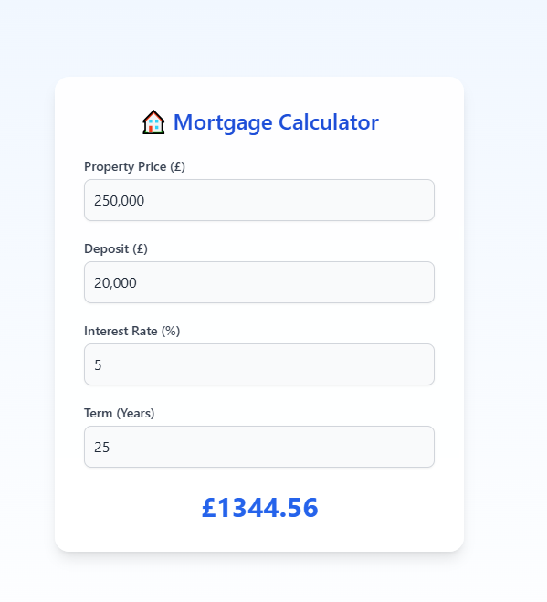
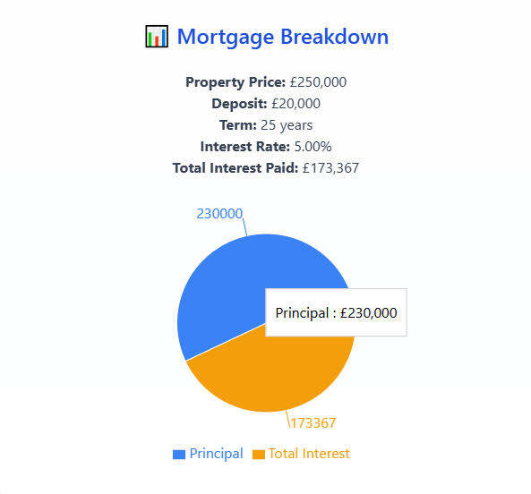

# 🏡 HomeEase – Mortgage Calculator & Dashboard

**HomeEase** is a responsive **React + TypeScript** web application designed to simplify mortgage estimation and visualisation.  
Users can input financial details, instantly view monthly repayments, and see a clear breakdown of **principal vs. interest** through an interactive dashboard.

---

## ✨ Features

- 💰 **Interactive Mortgage Calculator** – Instantly calculates monthly payments based on property price, deposit, term, and interest rate.  
- 📊 **Visual Dashboard** – Displays a dynamic **pie chart** of principal vs. total interest using Recharts.  
- 🧠 **Smart Global State Management** – Built with React Context and a custom hook (`useMortgage`).  
- 📱 **Responsive Design** – Fully optimised for both mobile and desktop layouts via Tailwind CSS.  
- ⚡ **Fast + Type-Safe** – Powered by Vite and TypeScript for speed and developer confidence.

---

## 🧩 Tech Stack

| Layer | Technology |
|-------|-------------|
| **Frontend Framework** | React 19 (Vite + TypeScript) |
| **Routing** | React Router v7 |
| **Styling** | Tailwind CSS 3 |
| **Charts** | Recharts |
| **State Management** | React Context API |
| **Build Tool** | Vite |

---

## ⚙️ Installation & Setup


### 1️⃣ Clone the repository

git clone https://github.com/MrAppiah/homeease-mortgage-calculator.git

cd homeease-mortgage-calculator

### 2️⃣ Install dependencies
npm install

### 3️⃣ Start the development server
npm run dev
Then open http://localhost:5173/ in your browser.

### 4️⃣ Build for production
npm run build


---

## 🧠 Project Structure
```bash
src/
├── components/
│ ├── MortgageCalculator.tsx # Calculator form and logic
│ └── MortgageDashboard.tsx # Visualization and summary
│
├── context/
│ └── MortgageContext.tsx # Global mortgage state provider
│
├── hooks/
│ └── useMortgage.tsx # Custom React hook for context access
│
├── App.tsx # App layout, navbar, and routes
├── index.tsx # Entry point with BrowserRouter
└── index.css # Tailwind global styles
 ```

---

## 📸 Screenshots

| Calculator | Dashboard |
|-------------|------------|
|  |  |

---

## 💡 Key Highlights

- Implemented **global mortgage state** using React Context + custom hooks.  
- Built a clean, **fully responsive UI** with Tailwind CSS.  
- Created interactive **data visualization** using Recharts.  
- Applied **modern React best practices** (functional components, hooks, and context).  
- Used **TypeScript** to ensure strong typing and maintainable code.

---

## 🎯 Learning Outcomes

- Strengthened understanding of **React state management** patterns.  
- Practiced **type-safe development** with TypeScript.  
- Enhanced skills in **UI/UX design** with Tailwind and responsive layout building.  
- Gained experience integrating **data visualization libraries** in React apps.  

---

## 👨‍💻 Author

**Emmanuel Appiah**  
Frontend Developer | React | TypeScript | UI/UX  
[💼 LinkedIn](https://www.linkedin.com/in/mrappiah/)

---

## 🪪 License
This project is open-source under the **MIT License**.


>>>>>>> fe3e548da326499e0bbd69e739120e5210ac07cf
